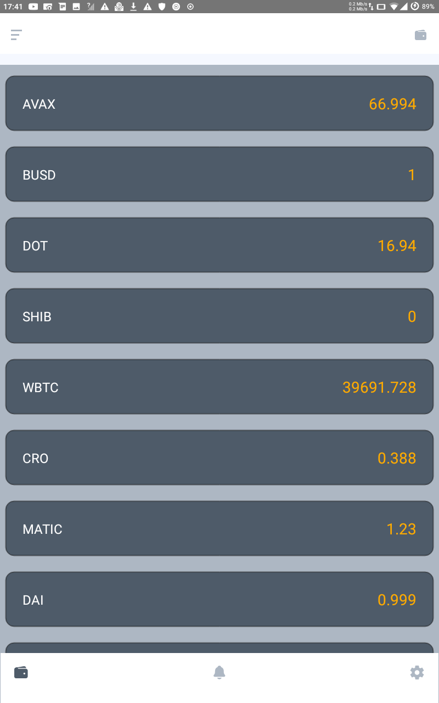
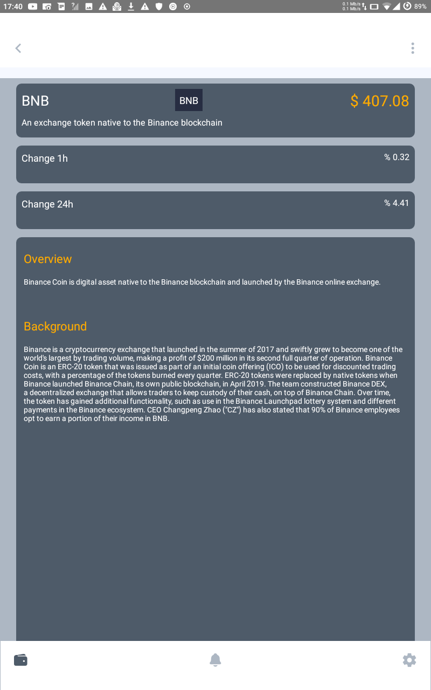

<h1 align="center"> RACE </h1>  

      

    Live prices crypto application for Android and IOS.

## Introduction

RACE updates the prices based on time and grab true and live data from different sources also allows seeing details of every crypto currency.

**Available for both iOS and Android.**

  
  

## Features

* Display crypto prices live
* Show price variation over time 
* See details about any crypto

## Todo
- [ ] Add iOS demo
- [ ] Add dashboard to monitor price variation over time 
- [ ] Alert and notification for price increase and decrease
- [ ] Sync option

  

## Build Process

- Follow the [React Native Guide](https://facebook.github.io/react-native/docs/getting-started.html) for getting started building a project with native code. **A Mac is required if you wish to develop for iOS.**
- Clone or download the repo
- `npm install` to install dependencies
- ` npx react-native run-ios` to start the packager and run the app in the iOS simulator
- ` npx react-native run-android` to start the packager and run the app in the the Android device/emulator 

Pull requests are more than welcomed!
